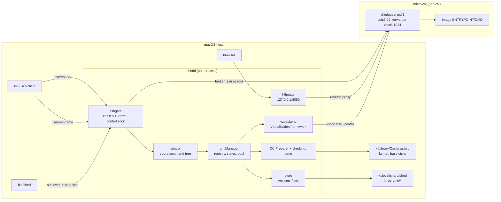

# shed design documents

These documents describe the architecture and design of shed as it is
implemented on `main`. They are written for contributors first: each one
explains how a subsystem works and why it is shaped the way it is. Each
document ends with a **Spec notes** section listing the concrete
invariants (ports, paths, names, wire formats, timeouts) that a
re-implementation could be checked against.

The top-level README explains what shed is for and how to use it. Start
there if you have not. `CLAUDE.md` holds operational notes for working
on the code.

## Reading order

| Document | Covers |
|----------|--------|
| [overview.md](overview.md) | The system in one page: processes, components, the path from `ssh box@shed` to a shell |
| [control-plane.md](control-plane.md) | The `ssh shed <command>` surface, the unix-socket client, command semantics |
| [ssh-gateway.md](ssh-gateway.md) | Username routing, authentication, brokering sessions into a VM, scp/sftp, `-L` |
| [http-front-door.md](http-front-door.md) | `<vm>.shed.localhost` routing, port selection, private-by-default and share links |
| [vm-lifecycle.md](vm-lifecycle.md) | The manager, state machine, resource pool, crash recovery, clone and rename, the backend seam |
| [images-and-storage.md](images-and-storage.md) | OCI pull, tar2ext4 base disks, data disks, overlay, the sheduntu bake, kernel, on-disk layout |
| [guest-agent.md](guest-agent.md) | shedguest as pid 1: root assembly, stage 2, embedded sshd, workload supervision, bake mode |
| [networking-and-protocols.md](networking-and-protocols.md) | NAT network, vsock ports, the control and forward protocols, DialGuest |
| [configuration.md](configuration.md) | config.toml, environment, `shedd install` and `shedd doctor`, build and signing |
| [decisions.md](decisions.md) | Design decisions with context and consequences, plus known gaps |

## Component map

## Conventions used in these documents

- Paths under the state directory are written relative to
  `~/.local/share/shed/` unless stated otherwise. Paths under the cache
  directory are relative to `~/Library/Caches/shed/`.
- "The daemon" is `shedd`. "The agent" is `shedguest`, running as pid 1
  inside a VM. "The client" is either OpenSSH or `bin/shed`.
- Code references use `package.Symbol` or `path/to/file.go`. Line
  numbers are avoided because they rot.
