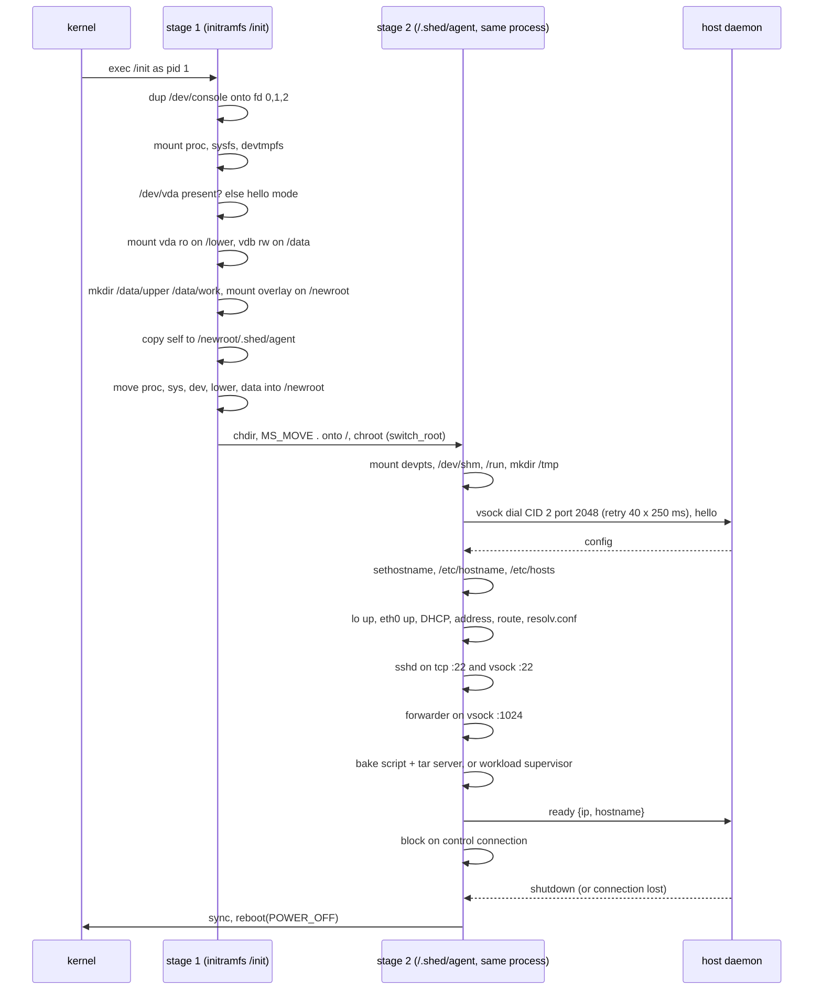

# Guest agent

`shedguest` is the only thing shed puts inside a VM that the image did
not bring. It is a static Go binary (linux/arm64, CGO disabled), packed
into the initramfs as `/init`, and it runs as pid 1 for the life of the
VM. It replaces an init system, an sshd, a DHCP client and a service
supervisor. Package: `cmd/shedguest`. A `!linux` stub keeps
`go build ./...` working on the host.

## Boot sequence

### Stage 1: assembling the root

Stage 1 runs from the initramfs with only the directories the
initramfs carries. It mounts the base disk read-only on `/lower` and the
data disk read-write on `/data`, creates `upper` and `work` on the data
disk if missing (first boot), and mounts
`overlay lowerdir=/lower,upperdir=/data/upper,workdir=/data/work` on
`/newroot`.

Before switching root it copies itself to `/newroot/.shed/agent`. The
initramfs is about to become unreachable, and the agent must be able to
re-exec itself later (for privilege-dropped sftp). The disk mounts are
moved to `/.shed/lower` and `/.shed/data` inside the new root so they
stay visible for debugging. `/.shed` is on the overlay's upper layer,
excluded from bakes.

switch_root is done by hand: `chdir("/newroot")`, `mount(".", "/",
MS_MOVE)`, `chroot(".")`, `chdir("/")`. The old initramfs is not freed
(no `pivot_root` cleanup); it is small.

If `/dev/vda` does not exist, the agent runs **hello mode**: it prints
the kernel release and machine and powers off. This is a diskless smoke
test of the kernel plus initramfs path.

### Stage 2: bringing the system up

Stage 2 is the same process, now in the real root. It mounts what
interactive sessions expect (`devpts` with `gid=5,mode=620,ptmxmode=666`,
a tmpfs on `/dev/shm`, a tmpfs on `/run`) and ensures `/tmp` exists (on
the overlay, not tmpfs). Then it dials the host.

**Handshake.** The agent connects over vsock to the host (CID 2) on
port 2048, retrying every 250 ms for up to 10 s while the host wires up
its listener. It sends `hello`, receives `config`, and later sends
`ready` or `error`. The connection stays open; the host uses it to
request shutdown, and its loss means the daemon died, upon which the
agent powers off. Wire format is in
[networking-and-protocols.md](networking-and-protocols.md).

**Identity.** Hostname from config, written to `/etc/hostname`, and
`/etc/hosts` gets `127.0.0.1 localhost`, `127.0.1.1 <hostname>` and
`::1 localhost` so sudo does not complain about an unresolvable
hostname.

**Network.** `lo` and `eth0` up via netlink. DHCPv4 with
`insomniacslk/dhcp`'s `nclient4` against macOS's bootpd on the vmnet
NAT subnet: 100 ms retransmit, 90 retries, 10 s overall. The fast
retransmit exists because bootpd occasionally drops a packet and the
default 5 s retry would turn that into a visible boot stall. The lease
yields address, mask (or the class default), default route and DNS
servers, which are written to `/etc/resolv.conf`. Any network failure
is reported to the host as `error` and the VM powers off.

**sshd, forwarder, workload.** Described below. Then `ready` with the
IP, and the agent blocks reading control messages.

## The embedded sshd

`gliderlabs/ssh` server on `:22`, with the same server also serving a
vsock listener on port 22. Auth is public key only, against the list
delivered in config: the user's authorized keys plus the daemon's broker
key. No keys means sshd refuses to start and the boot fails, because a
VM nobody can reach is worse than a clear error. The host key is a
fresh ed25519 key per boot; the gateway does not verify it.

### Who a session runs as

`resolveSessionTarget(preferredUser)` runs once at sshd start. If the
host asked for a user other than root and the image's `/etc/passwd` has
it, sessions run as that user (uid, gid, home, shell, and supplementary
groups from `/etc/group`). Otherwise root. A shell listed in passwd that
does not exist on disk falls back to `/bin/sh`; an empty home to `/`.
This is what makes sheduntu land in `dev` while `alpine` still lands in
root with no image contract.

Only session child processes drop privileges (via
`SysProcAttr.Credential`); the agent itself stays root so it can keep
serving, forward ports and power off.

### Session handling

For each session:

- Command present → `<shell> -c <raw command>`. No command → the shell
  as a login shell (`argv[0] = "-<basename>"`) so profiles load.
- Working directory is the user's home.
- Environment is built from scratch: `PATH` leading with
  `~/.local/bin` and `~/.local/share/mise/shims` before the system
  directories (so mise-managed tools work in non-interactive exec,
  where rc files never run), `HOME`, `USER`, `LOGNAME`, `SHELL`,
  `LANG=C.UTF-8`, and `TERM` when a pty was requested. Environment
  variables the gateway forwarded via `env` requests are accepted by
  the server library but not applied to the child; see
  [decisions.md](decisions.md).
- Pty requested and no command → `/etc/motd` is written first with
  `<vmname>` replaced by the hostname. The motd is baked into the image
  and cannot know the VM's name.
- Pty requested → `creack/pty` starts the command on a pty; window
  changes resize it; bytes are copied both ways.
- No pty → stdin/stdout/stderr pipes.
- Exit code is propagated; exec failure exits 127.

### sftp

The `sftp` subsystem covers `sftp` and modern `scp`. Root sessions are
served in-process with `pkg/sftp`. Non-root sessions re-exec
`/.shed/agent sftp-server` with the user's credential, home as the
working directory, and a minimal environment; the child serves sftp
over its stdio. That is the reason stage 1 parked a copy of the agent:
the sftp server must run as the user so created files are owned
correctly, and the simplest way to get a process with dropped
privileges serving the protocol is to be that process.

## The forwarder

`startForwarder` listens on vsock port 1024. Each accepted connection
carries one JSON line `{"port": N}` followed by raw bytes; the agent
dials `127.0.0.1:N` and splices the two streams, replaying any bytes the
JSON decoder buffered past the header. This gives the host a way to
reach any guest TCP service that does not depend on the NAT bridge,
which matters because macOS's Local Network privacy can silently block
host→guest TCP. Half-close is propagated in the host→guest direction
with `CloseWrite`.

## Workload supervision

`startWorkload` runs the image's `ENTRYPOINT + CMD` the way exe.dev runs
an image as a service, with two exceptions:

- Empty argv → nothing to run.
- A **bare shell** (`/bin/sh`, `/bin/bash`, `sh`, `bash`, `/bin/ash`,
  `/bin/dash`, `/bin/zsh` as the only argument) → skipped. That is the
  CMD of base images like `ubuntu` and `alpine`; there the VM is the
  product, not the process, and a shell with no tty would exit
  immediately anyway.

The environment is the image's `Env`, plus a default `PATH` if the image
set none. The working directory is the image's. Output goes to the
console (serial log). The supervisor restarts the process forever with
exponential backoff from 1 s to 30 s, reset to 1 s after a run that
lasted longer than a minute.

The agent does not install a general child reaper; it only waits on
processes it started. Daemonised grandchildren that get re-parented to
pid 1 are not reaped (see [decisions.md](decisions.md)).

## Bake mode

When config carries a `BakeScript`, the boot becomes an image bake.
After sshd and the forwarder are up, the agent runs the script with
`/bin/sh -c`, a fixed `PATH`, `HOME=/root` and
`DEBIAN_FRONTEND=noninteractive`, output to the console. A non-zero
exit is reported as `error`. On success it listens on
`127.0.0.1:1025`, serves exactly one tar of the merged root (see the
skip list in [images-and-storage.md](images-and-storage.md)), and then
reports `ready`, which the host reads as "baked and ready to harvest".
No workload is started in bake mode.

## Shutdown

`waitShutdown` returns on a `shutdown` message or on any decode error
(connection lost). Both paths lead to `powerOff`: `sync(2)` then
`reboot(LINUX_REBOOT_CMD_POWER_OFF)`. Reboot only returns on failure,
and pid 1 must never exit (the kernel panics), so the function blocks
forever after. The host sees the VM reach `Stopped` and settles the
record.

## Design notes

**Why pid 1 in Go rather than systemd from the image.** Boot is a few
hundred milliseconds of deterministic Go with no image contract:
distroless, alpine and ubuntu all boot the same way. The cost is that
images expecting systemd (`systemctl`) do not get it, which is
documented as a caveat.

**Why an embedded sshd rather than the image's.** Most images do not
ship one, and those that do need configuration. One Go server that
authenticates against host-delivered keys and runs sessions as a
host-chosen user works everywhere and keeps the guest contract at
zero.

**Why config over vsock rather than the kernel cmdline or a config
disk.** Cache-pure base disks and initramfs; no size limit; a natural
channel for `ready`, `error` and `shutdown` afterwards.

## Spec notes

- Runs as pid 1 from initramfs `/init`; refuses to run otherwise
  (except `sftp-server` mode).
- Disk roles: `/dev/vda` base (ro, lowerdir), `/dev/vdb` data (rw,
  `upper/` and `work/` at its root).
- Overlay options: `lowerdir=/lower,upperdir=/data/upper,workdir=/data/work`.
- Post-switch paths: agent copy at `/.shed/agent`; disks visible at
  `/.shed/lower` and `/.shed/data`.
- Runtime mounts: `devpts` (`gid=5,mode=620,ptmxmode=666`), tmpfs
  `/dev/shm` (`mode=1777`), tmpfs `/run` (`mode=755`); `/tmp` on the
  overlay.
- Control dial: vsock CID 2 port 2048, 40 attempts × 250 ms.
- Hostname files: `/etc/hostname`, `/etc/hosts` with `127.0.1.1
  <hostname>`.
- DHCP: `eth0`, 100 ms timeout × 90 retries, 10 s budget; writes
  `/etc/resolv.conf` from the lease.
- sshd: TCP `:22` and vsock port 22; pubkey only; keys = user keys +
  broker key; ephemeral ed25519 host key; refuses to start with zero
  usable keys.
- Session user: config `User` if present in `/etc/passwd` and not
  `root`, else root. Shell falls back to `/bin/sh` if missing; home to
  `/`.
- Session env: `PATH=$HOME/.local/bin:$HOME/.local/share/mise/shims:/usr/local/sbin:/usr/local/bin:/usr/sbin:/usr/bin:/sbin:/bin`,
  `HOME`, `USER`, `LOGNAME`, `SHELL`, `LANG=C.UTF-8`, `TERM` (pty only).
  Client env requests are not applied.
- motd: `/etc/motd` printed on pty sessions without a command, with
  `<vmname>` replaced by the hostname.
- sftp: root in-process; non-root via `/.shed/agent sftp-server` under
  the user's credential.
- Forwarder: vsock port 1024; header `{"port": N}` as one JSON value,
  then raw splice to `127.0.0.1:N`.
- Workload: `ENTRYPOINT + CMD`; skipped when empty or a bare shell;
  restart backoff 1 s doubling to 30 s, reset after a run > 1 min.
- Bake: script via `/bin/sh -c`, env `PATH`, `HOME=/root`,
  `DEBIAN_FRONTEND=noninteractive`; rootfs tar served once on
  `127.0.0.1:1025`; `ready` sent after the server is listening.
- Power off on `shutdown` message or control connection loss: `sync`,
  `reboot(POWER_OFF)`.
