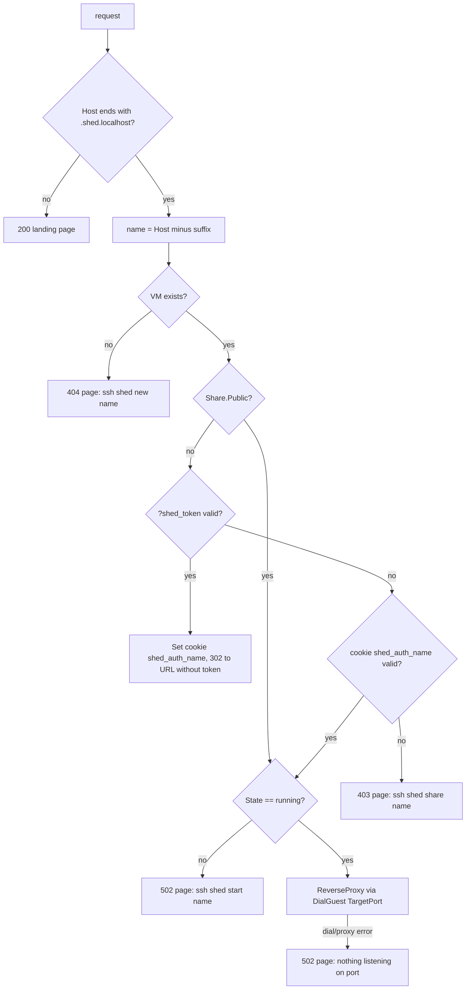

# HTTP front door

Every VM is reachable in a browser at `http://<vm>.shed.localhost:8080`.
The front door is a reverse proxy that routes on the `Host` header,
gates private VMs behind a signed token, and proxies into the VM over
`DialGuest`. Package: `internal/httpgate`.

## Request handling

The port in the `Host` header is stripped before matching. A request to
the bare suffix, or to any other host, gets the landing page rather
than an error, so `http://localhost:8080` explains itself.

The proxy is a `httputil.ReverseProxy` built per request:

- `Rewrite` sets the outbound scheme to `http`, the outbound URL host
  to the placeholder `guest:<port>`, keeps the original `Host` header
  for the guest (so name-based virtual hosts inside the VM work), and
  adds `X-Forwarded-*` headers.
- `Transport.DialContext` ignores the address it is given and returns
  `RunningVM.DialGuest(ctx, port)`. This is how the placeholder host
  works: nothing ever resolves it.
- `ErrorHandler` renders the "nothing listening" page instead of Go's
  default bare 502.

The front door does not start stopped VMs. A stopped VM gets a 502
page with the start command. This is a deliberate asymmetry with ssh
(which boots on demand): a browser reload loop should not be able to
boot machines.

## Target port selection

`TargetPort(rec)` picks, in order:

1. `Share.Port` if set via `ssh shed share port <vm> <port>`.
2. The smallest TCP port in the image's `EXPOSE` list. UDP entries are
   skipped at image-resolution time; the list is stored sorted
   ascending in `ImageInfo.ExposedPorts`.
3. `8000`, exe.dev's convention, when the image exposes nothing.

sheduntu exposes nothing, so a fresh sheduntu VM proxies to port 8000.

## Private by default

A VM is private unless `Share.Public` is true. Access to a private VM is
granted by a token derived from a per-install secret:

- Secret: 32 random bytes in `<state>/keys/share_secret`, created on
  first run, mode 0600. An existing file shorter than 32 bytes is
  replaced.
- Token: `hex(HMAC-SHA256(secret, "shed-share:" + name))` truncated to
  32 hex characters. Deterministic per VM name, so `ssh shed share`
  prints the same link every time and rotating access means rotating
  the secret.
- `ssh shed share <vm>` prints `http://<vm>.shed.localhost:8080?shed_token=<token>`.
- A request carrying a valid `shed_token` query parameter gets a
  cookie `shed_auth_<vm>` (value = token, `Path=/`, `HttpOnly`,
  `SameSite=Lax`, session-scoped) and a 302 redirect to the same URL
  with the parameter removed. Subsequent requests are authorised by the
  cookie. Comparison is constant-time.
- `share set-public` skips all of this; `share set-private` re-enables
  it. Existing cookies remain valid because the token does not change.
- `share add <vm> <email>` records the email on the VM record for
  exe.dev parity. It has no effect on access; everyone with the link is
  let in.

Renaming a VM changes its token, because the name is the HMAC input.

## Error pages

All non-proxied responses share one small dark HTML template with a
title, a lead sentence, and a hint containing the exact shed command to
fix the situation. Status codes: 200 landing, 404 unknown VM, 403
private, 502 not running or nothing listening.

## Design notes

**Why `*.shed.localhost`.** Browsers resolve any `*.localhost` name to
loopback without DNS or `/etc/hosts` edits, so no resolver setup is
needed. curl does not, hence the `--resolve` tip in the README.

**Why HMAC tokens rather than random per-VM secrets stored on the
record.** No state to persist per VM, the link is stable, and the record
stays a plain description of the VM. The trade-off is that revoking one
VM's link means rotating the install-wide secret.

**Why no TLS.** Everything is loopback on a single-user machine. A
local CA would add setup friction for no isolation gain. It is listed as
a known gap in [decisions.md](decisions.md).

## Spec notes

- Listener: `127.0.0.1:8080` (config `http_addr`). Host suffix:
  `shed.localhost`. URLs include the port unless it is 80.
- Routing: strip port from `Host`; if host equals the suffix or does
  not end in `.` + suffix → landing page; else VM name = host minus
  `.` + suffix.
- Default target port: 8000. Precedence: `Share.Port` > smallest
  exposed TCP port > default.
- Secret: 32 random bytes at `<state>/keys/share_secret`.
- Token: first 32 hex chars of HMAC-SHA256 over `"shed-share:" + name`.
- Query parameter: `shed_token`. Cookie: `shed_auth_<name>`, HttpOnly,
  SameSite=Lax, Path=/, no expiry.
- Token acceptance: 302 to the URL with `shed_token` removed, cookie
  set.
- Stopped VMs are never started by the front door.
- Outbound request: scheme http, `Host` header preserved from the
  client, `X-Forwarded-For/Host/Proto` added.
- Status codes: 200 landing, 404 no such VM, 403 private, 502 not
  running / not reachable / nothing listening.
