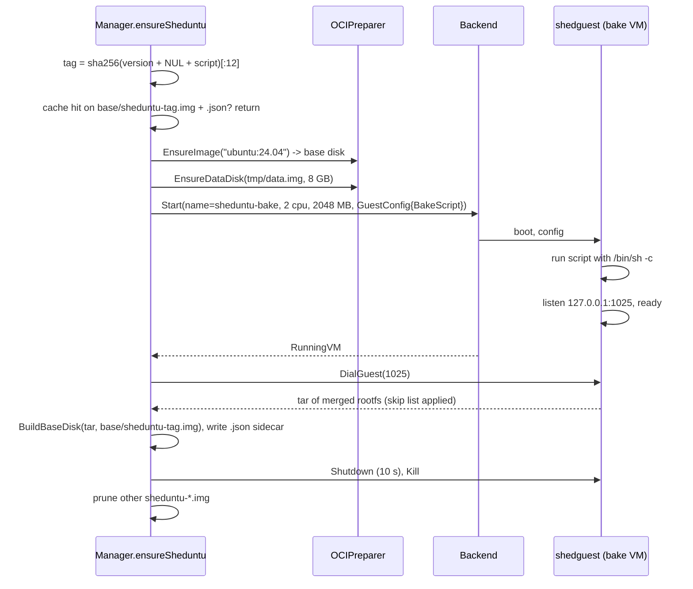

# Images and storage

How an OCI image reference becomes a bootable disk, how per-VM writable
state is kept, how the default image is produced, and where everything
lives on the host. Packages: `internal/image`, `internal/diskfs`,
`internal/kernel`, `internal/initramfs`, and the `OCIPreparer` and
`sheduntu` parts of `internal/vm`.

## The two-disk model

Every VM boots with two virtio block devices:

| Device | File | Contents | Sharing |
|--------|------|----------|---------|
| `/dev/vda` | `<cache>/base/<key>.img` | Read-only ext4 built from the image's flattened rootfs | Shared by every VM using the same image, attached read-only |
| `/dev/vdb` | `<state>/vms/<name>/data.img` | Writable ext4, sparse, sized to `disk_gb` | Per VM |

Inside the guest they meet in an overlayfs: `vda` is the lower layer,
`vdb/upper` and `vdb/work` are the upper and work directories, and the
merged view becomes `/` (see [guest-agent.md](guest-agent.md)). The
image is never modified; all writes land on the data disk. This is what
makes base disks cacheable by content, VMs cheap to create (one sparse
file), and clones cheap (one `clonefile`).

The base disk is attached read-only at the hypervisor level and is also
marked with ext4's read-only compat flag by `tar2ext4`, so the guest
kernel refuses to write to it even by accident.

## OCI image to base disk

`vm.OCIPreparer.EnsureImage(ref)`:

1. **Pull.** `image.Pull` parses the reference with go-containerregistry
   and fetches the manifest for platform `linux/arm64`. Credentials come
   from the default keychain (`~/.docker/config.json` and helpers) if
   present; anonymous pulls work for public images. Layers are not
   downloaded yet; `remote.Image` is lazy.
2. **Digest and config.** The image digest (`sha256:...`) is the cache
   key. The config file yields entrypoint, cmd, env, working dir and
   exposed ports. Exposed ports are parsed from `<port>/<proto>` keys;
   UDP entries are dropped; the list is sorted ascending. This becomes
   `vmspec.ImageInfo` on the VM record.
3. **Cache check.** If `<cache>/base/<hex digest>.img` exists, done.
4. **Flatten and convert.** `image.Flatten` returns
   `mutate.Extract(img)`: one tar stream with all layers merged and
   whiteouts applied. `diskfs.BuildBaseDisk` streams that tar into
   `tar2ext4.Convert` (Microsoft's pure-Go ext4 writer from hcsshim)
   with a 16 GiB maximum filesystem size. Ownership, modes, xattrs,
   symlinks, hardlinks and device nodes come from the tar headers. The
   rootfs is never extracted onto APFS, so no root privileges are
   needed and nothing is lost to macOS's filesystem semantics. A failed
   build removes the partial file.

A mutex in `OCIPreparer` serialises builds; they take seconds and
concurrency would only fight over the same file.

### Data disks

`diskfs.NewDataDisk(path, bytes)` creates the file, truncates it to the
requested size (APFS keeps the unwritten range as a hole), and runs
Homebrew's `mke2fs -q -F -t ext4 -E
root_owner=0:0,lazy_itable_init=1,lazy_journal_init=1`. The binary is
keg-only, so two Homebrew prefixes are probed before falling back to
`PATH`. Lazy inode table and journal init keep creation at around
0.3 s regardless of size. A 10 GB disk costs megabytes until written.
`EnsureDataDisk` is a no-op if the file already exists. Only Create
(and the bake) call it; Start assumes the disk is there.

`mke2fs` is the only external tool the daemon depends on. Growing a disk
after creation is not implemented.

## The default image: sheduntu

`sheduntu` is not a registry image. It is baked locally, once, by
shed's own machinery, and cached like any other base disk.
`vm.ensureImage` intercepts the references `sheduntu` and
`sheduntu:latest` and routes them to `ensureSheduntu`; everything else
goes to the OCI preparer.



Details worth knowing:

- **Cache key.** `SHA-256(sheduntuVersion + "\x00" + sheduntuScript)`,
  first 12 hex characters. The key covers the recipe and a manually
  bumped version string, **not** the upstream Ubuntu digest, so a baked
  image resolves offline with no registry round trip on the create
  path. Picking up upstream updates means bumping `sheduntuVersion`.
- **Sidecar.** `base/sheduntu-<tag>.img.json` holds the `ImageInfo` the
  bake produced: digest `sheduntu:<tag>`, `Cmd` `/bin/bash`, a default
  `PATH`. A cache hit requires both files.
- **The bake VM** is started directly on the backend, bypassing the
  manager's registry and pool. Its serial log is
  `<cache>/sheduntu-bake.log`, which is where a failed bake tells its
  story. Its data disk lives in a temp directory that is removed
  afterwards. The overall budget is 15 min.
- **The recipe** (the `sheduntuScript` constant) installs the everyday
  tool set with apt, mise and uv system-wide, starship, seeds skel
  dotfiles (zsh with fzf, zoxide, autosuggestions and syntax
  highlighting; tmux; mise with node 24; uv tuned for ext4), replaces
  the stock `ubuntu` user with `dev` (uid 1000, zsh, passwordless
  sudo), pre-warms node and a uv-managed python as `dev`, builds the
  zsh completion dump, and writes `/etc/motd` with a `<vmname>`
  placeholder.
- **Harvest.** The guest tars its merged root in parent-before-child
  order (tar2ext4 requires it), preserving uid/gid and detecting
  hardlinks by inode, and skips virtual filesystems, `/.shed`,
  `/lost+found`, per-boot files (`/etc/hostname`, `/etc/resolv.conf`,
  `/root/.ssh/authorized_keys`), sockets and fifos, and apt lists and
  caches. Mount-point directories are emitted first so they exist in
  the image.
- **Prune.** After a successful bake, every other `sheduntu-*.img` and
  sidecar in the base directory is deleted. Existing VMs are safe
  because Start re-resolves the image to the current bake.

The bake takes about a minute and prints progress to whoever triggered
it (`ssh shed new` stdout or a brokered session's stderr).

## Kernel

`kernel.Ensure(cacheDir)` returns `<cache>/kernel/3.28.0/Image`,
downloading it on first use. The source is the Kata Containers 3.28.0
release tarball for arm64 (zstd-compressed tar, about 600 MB); the
member extracted is `opt/kata/share/kata-containers/vmlinux-6.18.15-186`
(about 16 MB). The extracted file's SHA-256 must match a constant pinned
in the package; a mismatch deletes the download and fails. The cached
file is re-hashed on every daemon start, so a corrupted cache is caught.

This is the kernel Apple's own `container` stack direct-boots. It is
monolithic (no modules) with virtio blk/net/console/vsock, ext4 and
overlayfs built in, and it is an uncompressed `Image`, which
Virtualization.framework's Linux boot loader requires on arm64. Distro
kernels fail on both counts: compressed, and virtio as modules.

## Initramfs

`initramfs.Build` writes an **uncompressed** newc (SVR4 `070701`) cpio
archive with a hand-rolled writer:

```
dev/ proc/ sys/ newroot/ lower/ data/    directories, 0755
dev/console                              char device 5:1, 0600
init                                     shedguest binary, 0755
TRAILER!!!
```

The daemon writes it to `<state>/initramfs.cpio` atomically on every
start, so it always matches the embedded agent. Uncompressed avoids
depending on which decompressors the kernel was built with; the agent
is a few megabytes. The `/dev/console` node exists so pid 1 can open
its stdio before devtmpfs is mounted.

No per-VM data is in the initramfs or on the kernel command line
(`console=hvc0 rdinit=/init` is constant). Per-VM configuration arrives
over vsock, which keeps the initramfs and base disks identical across
VMs and therefore cacheable.

## On-disk layout

State directory, `~/.local/share/shed/` (override: `SHED_STATE_DIR`):

```
config.toml                optional overrides
authorized_keys            user public keys accepted by the gateway
known_hosts                written by the user's ssh client (via shedd install config)
shedd.lock                 flock; only one daemon per state dir
control.sock               unix socket for bin/shed (0600)
initramfs.cpio             rebuilt on every serve
keys/
  host_ed25519             gateway host key (OpenSSH PEM, 0600)
  broker_ed25519           key the daemon uses to log into guests as root
  share_secret             32 bytes, HMAC key for share tokens
vms/<name>/
  vm.json                  the record
  data.img                 writable ext4, sparse
  serial.log               guest console output (truncated per boot)
```

Cache directory, `~/Library/Caches/shed/`:

```
kernel/3.28.0/Image        verified guest kernel
base/<sha256 hex>.img      base disk per OCI image digest
base/sheduntu-<tag>.img    baked default image
base/sheduntu-<tag>.img.json   its ImageInfo sidecar
sheduntu-bake.log          serial log of the last bake
```

Deleting the cache directory is always safe; the next start re-fetches
the kernel and rebuilds base disks (and rebakes sheduntu). Deleting the
state directory loses VMs and keys.

## Design notes

**Why tar2ext4 rather than extracting and running mke2fs -d.** No root
needed, no APFS round trip (which would lose device nodes, setuid bits
on some paths, and be slow), and exact ownership fidelity. It is the
same architecture Apple's containerization uses.

**Why a shared read-only base plus overlay rather than a copy per VM.**
Creating a VM is one sparse file instead of a multi-hundred-megabyte
copy, and N VMs from one image cost one base disk.

**Why bake sheduntu with shed's own VMs rather than Docker or a
Dockerfile.** No Docker daemon dependency, the bake runs on the exact
kernel and agent the image will boot on, and the result is harvested
with full fidelity through the same tar2ext4 path as any image.

**Why the cache key excludes the upstream digest.** Offline resolution
and a fast create path won over automatic pickup of Ubuntu updates. The
version bump is the manual valve.

## Spec notes

- Base disk: `<cache>/base/<digest hex>.img`, ext4 via tar2ext4, max
  16 GiB, read-only compat flag set, attached read-only as `vda`.
- Data disk: `<state>/vms/<name>/data.img`, sparse, `mke2fs -t ext4 -E
  root_owner=0:0,lazy_itable_init=1,lazy_journal_init=1`, attached
  read-write as `vdb`.
- Image platform: `linux/arm64`. Auth: default docker keychain.
- `ImageInfo.ExposedPorts`: TCP only, ascending.
- sheduntu references: `sheduntu`, `sheduntu:latest`. Upstream base
  `ubuntu:24.04`. Cache key: first 12 hex chars of
  `SHA-256(version + "\x00" + script)`. Files
  `base/sheduntu-<tag>.img` + `.json`. Digest string `sheduntu:<tag>`.
- Bake VM: name `sheduntu-bake`, 2 cpus, 2048 MB, 8 GB temp data disk,
  15 min budget, serial log `<cache>/sheduntu-bake.log`, rootfs served
  on guest loopback TCP 1025.
- Bake skip list: `/proc /sys /dev /run /tmp /.shed /lost+found
  /etc/hostname /etc/resolv.conf /root/.ssh/authorized_keys
  /var/lib/apt/lists /var/cache/apt`, plus sockets and fifos.
- Kernel: Kata 3.28.0 arm64 release tarball, member
  `opt/kata/share/kata-containers/vmlinux-6.18.15-186`, SHA-256 pinned,
  cached at `<cache>/kernel/3.28.0/Image`, verified on every start.
- Initramfs: uncompressed newc cpio; entries `dev proc sys newroot
  lower data` (dirs), `dev/console` (c 5 1), `init` (agent); written
  to `<state>/initramfs.cpio` on every start.
- Kernel cmdline: `console=hvc0 rdinit=/init`, no per-VM data.
