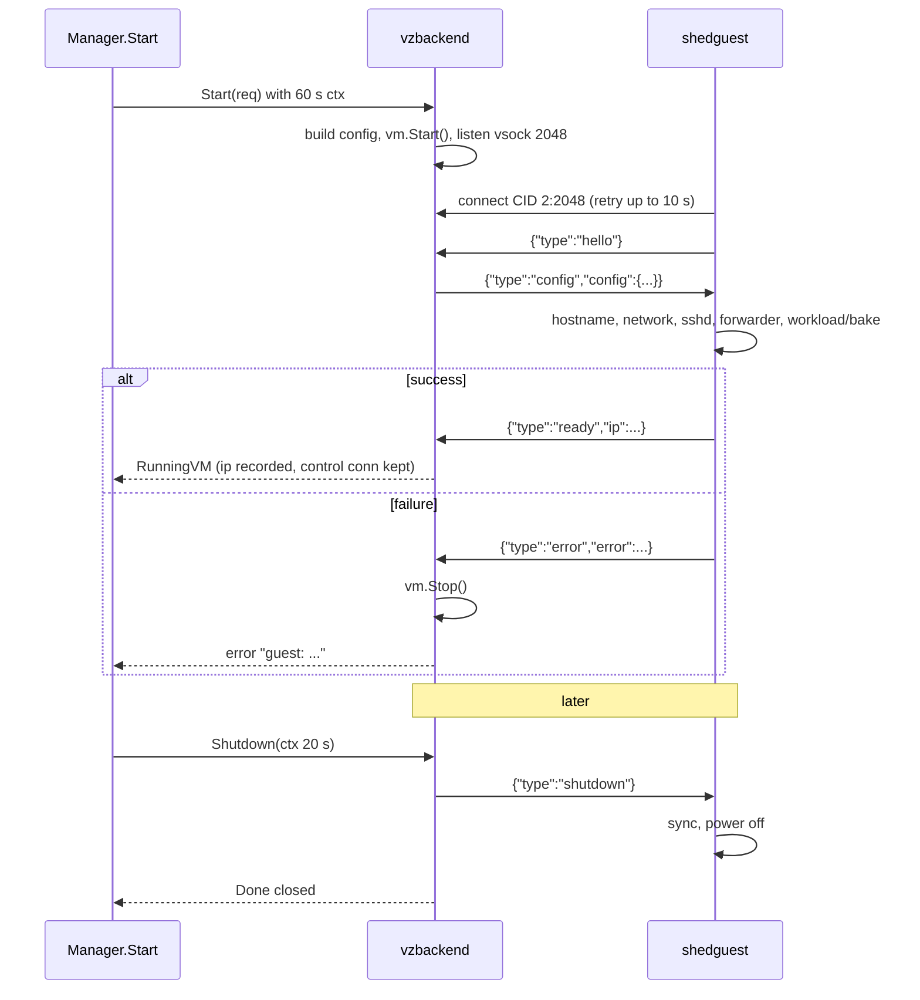

# Networking and protocols

How bytes move between the host and a guest: the NAT network, the vsock
channels, the JSON protocol the daemon and agent speak, and the
`DialGuest` seam that hides transport selection from everything above
it. Package: `internal/vsockproto` for the shared definitions;
`internal/backend/vzbackend` and `cmd/shedguest` for the two ends.

## The guest's network

Each VM has one virtio-net device on a Virtualization.framework **NAT
attachment**. macOS provides the bridge (`bridge100`), a DHCP server
(bootpd) and NAT to the outside world; no configuration or extra
entitlement is needed beyond `com.apple.security.virtualization`. The
guest gets a private address from bootpd, a default route through the
bridge, and macOS's DNS servers. Outbound traffic from the guest just
works. Inbound traffic from other machines is impossible, which is
intended.

The MAC address is derived from the VM name (see
[vm-lifecycle.md](vm-lifecycle.md)), so bootpd hands the same VM the
same address across restarts as long as its lease table remembers it.

### The TCC problem

macOS 15's Local Network privacy can block host processes from opening
TCP connections to guests on the bridge. When it does, the failure mode
is `no route to host` or a silent timeout, not a permission dialog, and
it depends on how the daemon was launched. shed treats this as a fact
of the platform rather than a bug: every host→guest connection has a
vsock fallback that does not touch the IP stack.

## vsock channels

virtio-vsock connects the host (context ID 2) and a guest without any
IP configuration. The vz device exposes per-VM `Listen(port)` and
`Connect(port)` on the host side; the guest uses `mdlayher/vsock`.

| Port | Listener | Dialer | Purpose |
|------|----------|--------|---------|
| 2048 | host (per VM socket device) | guest, at boot | Control channel: hello, config, ready/error, shutdown |
| 1024 | guest agent | host, on demand | Port forwarder: one connection per forwarded TCP stream |
| 22 | guest agent | (unused by the host today) | The embedded sshd also serves on vsock |

The host currently reaches the guest sshd via the forwarder (port 1024
with header `{"port": 22}`) when TCP fails, not via the vsock port 22
listener. That listener exists as a second path and is harmless.

## The control protocol

JSON values, one per message, encoded with Go's `encoding/json` over the
vsock stream. Both sides use a streaming decoder, so message framing is
"the next JSON value"; in practice each message is one line.

```json
{"type": "hello"}                                       guest → host
{"type": "config", "config": { ... }}                   host → guest
{"type": "ready", "ip": "192.168.64.5", "hostname": "box"}   guest → host
{"type": "error", "error": "network: dhcp request: ..."}     guest → host
{"type": "shutdown"}                                    host → guest
```

All fields other than `type` are `omitempty`. The `config` payload:

```json
{
  "hostname": "box",
  "authorized_keys": ["ssh-ed25519 AAAA... me@mac", "ssh-ed25519 AAAA... shed-broker"],
  "entrypoint": ["/docker-entrypoint.sh"],
  "cmd": ["nginx", "-g", "daemon off;"],
  "env": ["PATH=...", "NGINX_VERSION=..."],
  "working_dir": "/",
  "user": "dev",
  "bake_script": ""
}
```

`user` is the preferred login user; the agent falls back to root if the
image lacks it. `bake_script`, when non-empty, switches the boot into
bake mode.

### Sequence



Host-side failure handling during the handshake: if the VM reaches
`Stopped` or `Error` before `ready` (a kernel panic, a stage 1 failure),
the error is `vm stopped during boot (see serial log)`; if the context
expires, `boot: context deadline exceeded`. Either way the manager
marks the VM `error` and includes the serial log path in its message.

Guest-side, `waitShutdown` treats any decode error as the host having
gone away and powers off. That is the mechanism by which VMs die with
the daemon even when the daemon is killed uncleanly: the vsock
connection breaks, and the guest shuts itself down (the hypervisor
tearing down with the process makes this moot in practice, but it is
correct in isolation).

Unknown message types are logged by the guest and ignored.

## The forward protocol

A forward connection is opened by the host to guest vsock port 1024.
The first JSON value is the header:

```json
{"port": 8000}
```

Everything after it, in both directions, is the raw TCP stream to and
from `127.0.0.1:<port>` inside the guest. The guest replays bytes the
JSON decoder over-read past the header before splicing, so a client
that sends its first request immediately after the header (an HTTP
request, an ssh banner) loses nothing. When the host side hits EOF the
guest half-closes the TCP side.

## DialGuest

`RunningVM.DialGuest(ctx, port)` is the only way the gateway, the front
door and the bake harvester reach a guest port. In vzbackend:

1. If the guest reported an IP, try `tcp` to `<ip>:<port>` with a
   750 ms dial timeout.
2. On any failure, open a vsock connection to port 1024, write the
   forward header, and return the connection.

The result is that under TCC the whole system silently runs over vsock
with a 750 ms penalty per connection, and without TCC it runs over the
NAT bridge with no penalty. Callers cannot tell the difference, and the
ports they ask for (`22`, the HTTP target port, an `ssh -L`
destination, `1025` for a bake) are always interpreted as ports on the
guest's loopback or primary interface.

A consequence for `ssh -L`: the destination host the ssh client passes
is ignored, since both transports terminate at the guest itself.

## Serial console

The guest kernel's console and the agent's stdout/stderr go to a virtio
console backed by a file, `<state>/vms/<name>/serial.log` (or
`<cache>/sheduntu-bake.log` for a bake). The file is truncated on each
boot. It is the first place to look when a VM fails to start, and every
start error the manager returns names it.

## Design notes

**Why vsock for control rather than a virtio serial port or the
network.** vsock is available before the guest has an IP, needs no
guest configuration, is not subject to TCC, and gives ordinary
`net.Conn` semantics on both ends. It is also what Apple's own tooling
uses.

**Why TCP first, vsock second in DialGuest, not vsock always.** vsock
through the agent's forwarder adds a user-space hop inside the guest
per connection. When the bridge works, direct TCP is faster and lets
the guest see a real peer address. The fallback costs one 750 ms
timeout per connection under TCC, which is acceptable for a
single-user tool.

## Spec notes

- Network device: one virtio-net, NAT attachment, MAC derived from the
  name; guest configures itself via DHCPv4 on `eth0`.
- Host CID: 2. Control port: 2048 (host listens, guest dials).
  Forward port: 1024 (guest listens, host dials). Guest sshd also on
  vsock port 22.
- Control messages: JSON values; `type` ∈ `hello ready error`
  (guest→host), `config shutdown` (host→guest); optional fields `ip`,
  `hostname`, `error`, `config`.
- Config fields: `hostname`, `authorized_keys`, `entrypoint`, `cmd`,
  `env`, `working_dir`, `user`, `bake_script`.
- Handshake order: hello → config → ready | error. The control
  connection is held open for `shutdown`; its loss powers the guest
  off.
- Forward header: one JSON value `{"port": N}`, then raw bidirectional
  bytes to guest `127.0.0.1:N`.
- DialGuest: TCP to guest IP with 750 ms timeout, else vsock forward.
  Destination is always inside the guest.
- Bake harvest port: guest loopback TCP 1025, reached via DialGuest.
- Serial console: `console=hvc0` to `<state>/vms/<name>/serial.log`,
  truncated per boot.
