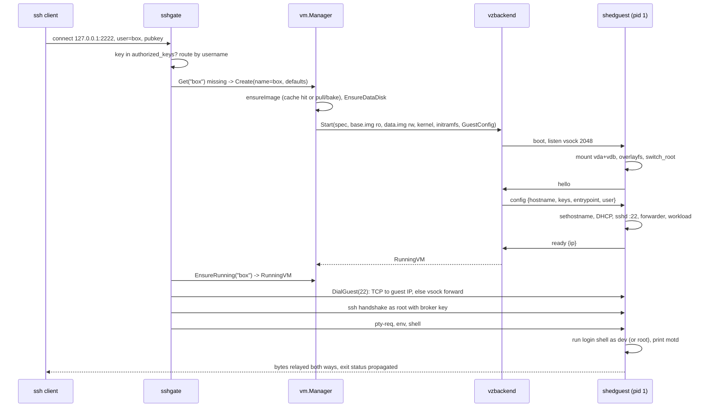

# Overview

shed is a local clone of exe.dev: a pile of small Linux virtual machines
behind one Mac, addressed by name and managed over ssh. This document is
the one-page map. The other documents in this directory go one level
deeper per subsystem.

## What runs where

There are three programs in the repository and two of them run.

| Program | Where it runs | Role |
|---------|---------------|------|
| `shedd` | macOS, one process, foreground | The daemon. ssh gateway, control plane, HTTP front door, VM manager, hypervisor driver. |
| `shedguest` | Linux, pid 1 inside every VM | The guest agent. Assembles the root filesystem, brings up networking, serves ssh, supervises the image workload, talks to the daemon over vsock. |
| `shed` | macOS, short-lived | A local control client. Sends its argv to the daemon over a unix socket and streams the result back. Parses nothing itself. |

`shedguest` is cross-compiled for linux/arm64 with CGO disabled and
embedded into `shedd` at build time (via `internal/initramfs`). The
daemon writes it out as the only file in a tiny initramfs, so the guest
side is always the version the daemon was built with.

All VMs are children of the daemon process in the Virtualization
framework sense: they live inside `shedd`'s address space and die with
it. That is an accepted consequence of using Virtualization.framework
directly, and the manager reconciles on restart (see
[vm-lifecycle.md](vm-lifecycle.md)).

## The three roles of the daemon

`cmd/shedd/serve.go` wires everything together. After loading config,
taking the daemon lock and ensuring keys, kernel and initramfs exist, it
starts:

1. **The ssh gateway** (`internal/sshgate`) on `127.0.0.1:2222` and on
   the unix socket `control.sock`. Routing is by ssh username. The
   reserved user `shed` reaches the control plane; any other username
   names a VM and the session is brokered into that VM's sshd.
2. **The HTTP front door** (`internal/httpgate`) on `127.0.0.1:8080`.
   `http://<vm>.shed.localhost:8080` reverse-proxies to a port inside the
   named VM. VMs are private by default and opened with a signed link.
3. **The VM manager** (`internal/vm`) which owns the registry of VM
   records, drives lifecycle transitions through a `backend.Backend`
   (the real one is `vzbackend`, on Apple's Virtualization.framework via
   Code-Hex/vz), accounts the resource pool, and keeps `vm.json` files
   truthful.

The gateway and the front door never talk to the hypervisor. They ask
the manager for a running VM handle and call `DialGuest(port)` on it.
That method is the seam that hides how bytes reach the guest (NAT TCP or
a vsock forward), and it is the reason a different backend could be
dropped in.

## Package layout

```
cmd/shedd/            daemon: serve | install | doctor (bare invocation = serve)
cmd/shed/             local control client over control.sock
cmd/shedguest/        guest agent (linux only; stub on other platforms)
internal/
  config/             defaults + config.toml
  store/              state directory, vm.json persistence, daemon flock
  keys/               host key, broker key, authorized_keys handling
  vm/                 Manager, Clone/Rename, OCIPreparer, sheduntu bake
  vm/vmspec/          shared record types (Spec, VM, State, ImageInfo, Share)
  backend/            Backend and RunningVM interfaces
  backend/vzbackend/  Virtualization.framework implementation
  backend/stubbackend/ fake backend for tests
  image/              OCI pull + flatten (go-containerregistry)
  diskfs/             tar2ext4 base disks, mke2fs data disks
  kernel/             pinned Kata kernel download, verify, cache
  initramfs/          newc cpio builder embedding shedguest as /init
  sshgate/            gliderlabs/ssh server, username routing, broker
  control/            cobra command tree bound to an ssh session
  httpgate/           reverse proxy, host routing, share tokens
  vsockproto/         host<->guest JSON protocol and port constants
```

Dependency direction is strictly downward: `vmspec` and `vsockproto`
depend on nothing in the repo; `backend` depends on those two; `vm`
depends on `backend`, `store`, `config`, `diskfs`, `image`; `control`,
`sshgate` and `httpgate` depend on `vm`. `cmd/shedd` is the only place
that knows about every package.

## The path from `ssh box@shed` to a shell

This is the single most important flow in the system. Everything else
supports it.



Timing on the reference machine: a VM that already has a cached base
disk boots to a usable shell in about a second. Creating a new VM adds
about 0.3 s for the data disk. The first use of the default image adds a
one-time bake of about a minute.

## State and caches on disk

Two directory trees, with different lifetimes:

- **State** (`~/.local/share/shed/`, override with `SHED_STATE_DIR`):
  things that cannot be regenerated. VM records and disks, the daemon's
  key material, the authorized_keys file, config.toml.
- **Cache** (`~/Library/Caches/shed/`): things that can be re-fetched
  or rebuilt. The guest kernel, base disks keyed by image digest, the
  baked sheduntu image.

[images-and-storage.md](images-and-storage.md) has the full layout.

## Security model in one paragraph

Everything listens on loopback or a unix socket; there is no network
exposure beyond the Mac. ssh to the gateway is key-only against
`authorized_keys`. The unix socket has no ssh-level auth because its
0600 file mode is the auth. Inside every VM the daemon is trusted
absolutely: the broker key is injected into each guest's authorized
keys and the daemon logs in as root with it. Guest host keys are
ephemeral and unverified, because the transport (NAT to a VM the daemon
itself booted, or vsock) is what carries trust. HTTP access to a private
VM requires an HMAC token derived from a per-install secret. The VM
boundary is the isolation boundary: the guest cannot see the host's
files or processes.

## Spec notes

- Three binaries: `shedd` (host daemon), `shedguest` (linux/arm64 guest
  agent, embedded in shedd), `shed` (host client).
- Daemon listeners: ssh `127.0.0.1:2222`, ssh over unix socket
  `<state>/control.sock` (mode 0600), HTTP `127.0.0.1:8080`. All
  configurable except the socket path.
- Reserved ssh username: `shed`. Every other username is a VM name.
- VMs run inside the daemon process and do not survive it.
- Host reaches a guest TCP port only through `RunningVM.DialGuest`.
- Guest kernel: Kata Containers static arm64 build, version 3.28.0,
  member `vmlinux-6.18.15-186`, pinned by SHA-256.
- Guest agent is pid 1; no systemd is executed.
