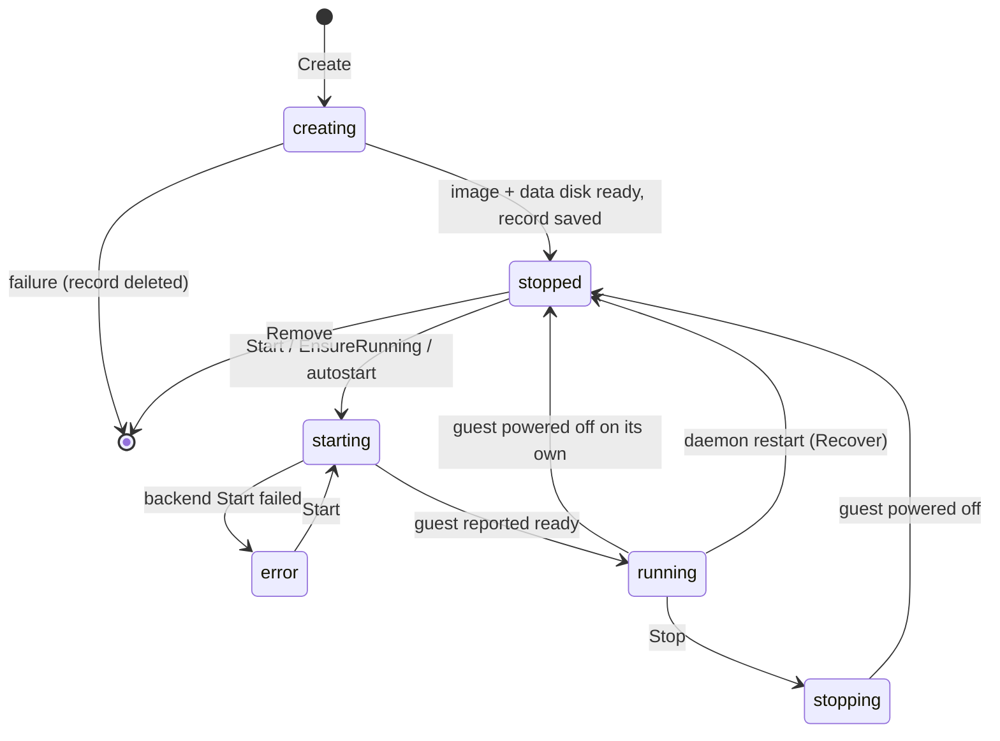

# VM lifecycle

`vm.Manager` (package `internal/vm`) owns every VM the daemon knows
about. It holds the in-memory registry, drives state transitions through
a `backend.Backend`, enforces the resource pool, and keeps the persisted
records truthful, including across daemon crashes. This document covers
the manager, the record model, the backend seam, and the two operations
that live beside them: clone and rename.

## The record

Persisted as `<state>/vms/<name>/vm.json`, indented JSON, written
atomically (temp file + rename). Types live in `internal/vm/vmspec` so
every layer can use them without importing the manager.

```
VM
  spec            Spec       what the user asked for
    name          string     ^[a-z0-9][a-z0-9-]{0,62}$ (also ssh user, hostname, URL label)
    image         string     as given ("sheduntu", "nginx:latest", ...)
    cpus          int
    memory_mb     int
    disk_gb       int
    created       time       UTC
    autostart     bool       start when the daemon starts
  image           ImageInfo  what the image resolved to at create time
    digest        string     "sha256:..." or "sheduntu:<tag>"
    entrypoint    []string
    cmd           []string
    env           []string
    working_dir   string
    exposed_ports []int      TCP only, ascending
  share           Share      HTTP front door settings
    port          int        0 = smallest exposed port
    public        bool
    emails        []string   parity only
  state           State      see below
  last_stop_reason string    why it last stopped (or the start error)
  ip              string     last known guest IP, cleared when stopped
```

`ImageInfo` is captured once at create time so that later starts do not
re-pull or re-resolve the image reference. The base disk path is not
stored; it is re-derived from the image on every start because the
cache may have been pruned.

Names double as ssh usernames, guest hostnames and URL host labels,
which is why the character set is so narrow. The name also seeds the
VM's MAC address: `06:` followed by the first five bytes of
`SHA-256("shed-mac:" + name)`. `06` is a locally administered unicast
prefix. A stable MAC means macOS's DHCP server hands out the same lease
across restarts, which makes ARP tables and logs debuggable.

## State machine



States are strings in the record: `creating`, `stopped`, `starting`,
`running`, `stopping`, `error`. There is no `deleting` state; Remove
holds the lock, deletes the entry, then removes the directory.

`last_stop_reason` values: `"guest powered off"` (watcher saw the VM
stop while `running`), `"requested"` (Stop completed), `"daemon
restart"` (set by Recover), or the error text when a start failed.

### Concurrency model

One mutex guards the registry map and every record. Each entry carries
a `busy` string naming the operation in progress (`creating`,
`starting`, `stopping`). Long operations (image pull, bake, boot,
graceful shutdown) run **outside** the lock with `busy` set; any other
operation on that VM fails fast with `vm "x" is busy (starting)` rather
than blocking. Reads (`List`, `Get`) copy the record out under the lock
and never block on a busy VM.

The watcher goroutine started by every successful `Start` waits on
`RunningVM.Done()` and calls `settle`. `Stop` also calls `settle` after
`Done` closes. `settle` is idempotent and checks that the entry's
current handle is still the one it was called for, so a stop racing a
guest-initiated power-off, or a stale watcher after a restart, cannot
corrupt the record.

## Operations

**Create.** Fill defaults from config (image, cpus, memory, disk), validate the name and the spec (`Backend.Validate`: cpus ≥ 1, memory ≥ 128 MB, disk ≥ 1 GB). Under the lock: reject duplicate names, reserve disk quota, insert the entry as `creating`/busy. Outside the lock: resolve the image (pull or bake, with progress to the caller's writer), create the data disk. Under the lock: mark `stopped`, save. Any failure before save deletes the entry and directory. Unless `NoStart`, `Start` follows; a start failure after a successful create returns the record and an error prefixed `created, but start failed`.

**Start.** Under the lock: must exist, not be busy, and be `stopped` or `error` (`running` returns nil, other states error). Check cpu and memory quota. Mark `starting`/busy. Outside the lock: re-resolve the base disk (fast cache hit), call `Backend.Start` with a 60 s context, passing the spec, both disk paths, kernel, serial log path (`vms/<name>/serial.log`) and the guest config (hostname = name, authorized keys from the `GuestKeys` callback, entrypoint/cmd/env/workdir from `ImageInfo`, preferred login user from config). On success: `running`, IP recorded, watcher started. On failure: `error` with the message, and the serial log path is included in the returned error.

**Stop.** Must be `running` with a live handle and not busy. Mark `stopping`/busy, call `RunningVM.Shutdown` with a 20 s context (which itself falls back to `Kill`), wait for `Done`, settle to `stopped`/`"requested"`.

**Restart.** Stop if running, then Start.

**Remove.** Not busy. Stop first if running, then delete the entry and `os.RemoveAll` the VM directory (record, data disk, serial log).

**EnsureRunning.** The on-demand boot used by the ssh broker and `-L`: return the handle if running, else Start and return the new handle. **Running** returns the handle only if already running (used by the HTTP front door, which must not boot).

**UpdateShare.** Mutate `Share` under the lock and save.

**Recover** (daemon start). Load every `vm.json`. Any record not in `stopped` or `error` is demoted to `stopped` with reason `"daemon restart"` and its IP cleared, then saved. Directories without a `vm.json` are skipped as half-created; a corrupt `vm.json` aborts startup.

**AutostartAll** (after listeners are up). Start every `stopped` VM with `autostart` set; failures are logged.

**StopAll** (daemon shutdown on SIGINT/SIGTERM). Stop all running VMs in parallel within a 30 s budget, then close the listeners.

## Resource pool

The pool is three ceilings from config: cpus, memory, disk. Usage is
**derived** from the registry on every check, never persisted:

- Disk counts for every VM regardless of state (a stopped VM keeps its
  disk).
- CPU and memory count for VMs in `running`, `starting` or `stopping`.

Create and Clone check disk; Start checks cpu and memory. Errors are
phrased for the user: `pool exhausted: need 2 cpus, 1 free (stop a vm
or raise pool.cpus)`. `ls -l` prints used/total.

## Clone and rename

**Clone** (`ssh shed cp src dst`). Validate `dst`, check `src` exists
and is not busy, check disk quota. If `src` is running, **stop it**
first: a mounted ext4 cannot be copied consistently. Build the new
record: same image, cpus, memory, disk and `ImageInfo`; new `created`;
`autostart` not carried over; `Share` carries only `port` (clones start
private, emails are dropped); state `stopped`. Copy the data disk with
`clonefile(2)`, APFS's copy-on-write file clone, which is instant and
costs no space until blocks diverge. The base disk is shared by digest
and needs no copy. Save, register, and if `src` was running, start it
again. The clone gets its own MAC and hostname from its name.

**Rename.** Under the lock: new name valid and unused, source not busy
and not `running` or `starting` (the name seeds the MAC and hostname,
so a running VM cannot be renamed). Rename the VM directory, update the
record, save. Because the share token is derived from the name, a
renamed VM has a new share link.

## The backend seam

```go
type Backend interface {
    Name() string
    Validate(spec vmspec.Spec) error
    Start(ctx context.Context, req StartRequest) (RunningVM, error)
}

type StartRequest struct {
    Spec          vmspec.Spec
    BaseDiskPath  string            // read-only ext4 from the image (vda)
    DataDiskPath  string            // writable per-VM ext4 (vdb)
    KernelPath    string
    SerialLogPath string
    GuestConfig   vsockproto.Config
}

type RunningVM interface {
    Shutdown(ctx context.Context) error   // graceful; falls back to Kill
    Kill() error
    Done() <-chan struct{}                // closed when fully stopped
    GuestIP() (net.IP, bool)
    DialGuest(ctx context.Context, port int) (net.Conn, error)
}
```

`Start` blocks until the guest agent reports ready (or the context
expires), so a returned `RunningVM` is always sshable. Two
implementations exist:

- **vzbackend**: the real one. Builds a Virtualization.framework
  configuration (Linux boot loader with the Kata kernel and the
  initramfs, cmdline `console=hvc0 rdinit=/init`; virtio console to a
  serial log file; two virtio-blk devices, base read-only and data
  read-write, caching automatic, sync fsync; one virtio-net on a NAT
  attachment with the derived MAC; one vsock device; one entropy
  device), starts it, listens on vsock port 2048 and runs the handshake
  described in [networking-and-protocols.md](networking-and-protocols.md).
  `Done` closes when vz reports `Stopped` or `Error`. `Shutdown` sends
  the shutdown message on the control connection and waits; on context
  expiry it calls `Kill`, which is `vm.Stop()` plus up to 5 s of waiting.
- **stubbackend**: for tests. Instant starts, a fake IP per VM
  (`198.51.100.N`), an optional injected start failure, an optional
  dialer for `DialGuest`, and `StopFromGuest()` to simulate the guest
  powering off.

The manager, control plane, gateway and front door are all exercised
against the stub in unit tests without virtualization.

## Design notes

**Why derive pool usage instead of persisting counters.** Counters
drift; the registry is the truth and is small. One O(n) pass per check
is free at this scale.

**Why stop the source to clone.** `clonefile` snapshots the file's
current blocks; a live ext4 journal would make the clone need fsck at
best. The stop-clone-start round trip is about two seconds, which is
still "instant" from the user's chair.

**Why records reconcile to `stopped` rather than trying to reattach.**
Virtualization.framework VMs are objects inside the daemon process.
There is nothing to reattach to after a crash; the honest thing is to
say so and boot on demand.

## Spec notes

- Record path: `<state>/vms/<name>/vm.json`, atomic write via temp +
  rename; VM directory also holds `data.img` and `serial.log`.
- Name regex: `^[a-z0-9][a-z0-9-]{0,62}$`.
- MAC: `06:` + first 5 bytes of `SHA-256("shed-mac:" + name)`.
- States: `creating stopped starting running stopping error`.
- Start preconditions: state `stopped` or `error`, not busy, cpu and
  memory within pool. `running` → no-op success.
- Stop precondition: `running` with live handle, not busy.
- Rename precondition: not `running`/`starting`, not busy.
- Recover: any state other than `stopped`/`error` → `stopped`,
  `last_stop_reason = "daemon restart"`, IP cleared.
- Pool accounting: disk for all VMs; cpu and memory for
  `running`/`starting`/`stopping`.
- Timeouts: backend Start 60 s; graceful Shutdown 20 s then Kill; Kill
  waits up to 5 s; StopAll 30 s; Create 10 min (from callers).
- Backend Validate: cpus ≥ 1, memory ≥ 128 MB, disk ≥ 1 GB.
- Clone: quiesce a running source; `clonefile` the data disk; share the
  base disk; carry over spec sizes, image and `share.port`; drop
  `autostart`, `share.public`, `share.emails`.
- vz device set: Linux boot loader + initrd, cmdline `console=hvc0
  rdinit=/init`, 1 virtio console (file), 2 virtio-blk (vda ro, vdb
  rw), 1 virtio-net (NAT, derived MAC), 1 vsock, 1 entropy.
